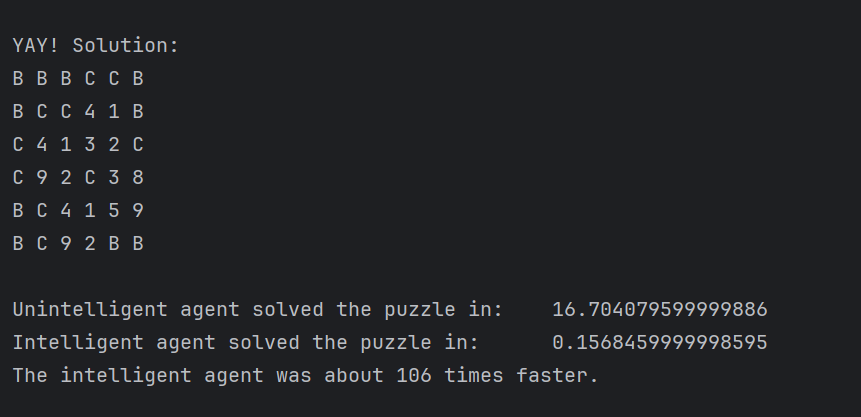

# Kakuro Intelligent Agent

This project includes agents that get a Kakuro puzzle as input and solve it.
The "unintelligent agent" solves the puzzle using backtracking, and the
"intelligent agent" uses backtracking and the Minimum Remaining Values (MRV) heuristic.

The program outputs the solution to the puzzle, the time it took the
unintelligent and intelligent agent to solve the puzzle, and how many
times faster the intelligent agent was compared to the unintelligent agent.

## How to Run
You can specify the Kakuro puzzle you want to solve in the `main.py` file; there is
a sample puzzle provided in `main.py`.
Then you can run the `main.py` file.

The program will solve the puzzle using both agents and output the solution,
the time taken by each agent, and how many times faster the intelligent agent
was compared to the unintelligent agent.

## Screenshot
The following screenshot is part of a sample output of the program.

## Attributions
Sample puzzle's source: https://krazydad.com/, 5x5 Puzzles, Volume 1, Book 1
